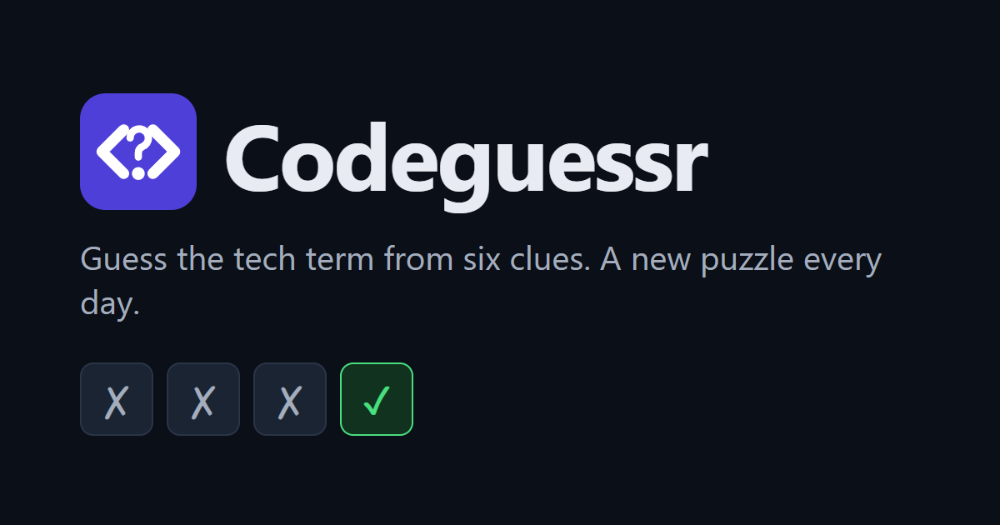

# Codeguessr

[](https://codeguessr.joeyoosenbrug.nl)

A daily Wordle-style puzzle for developers: guess the framework, language, tool or protocol from a sequence of clues.

**Live:** [codeguessr.joeyoosenbrug.nl](https://codeguessr.joeyoosenbrug.nl) · [Nederlands](https://codeguessr.joeyoosenbrug.nl/nl/)

## About

Every day at 00:00 UTC there is one new puzzle, the same for everyone. The answer is a tech term: React, Kubernetes, DNS, Vim, C++…

- You start with the vaguest clue. Every wrong guess, or a skip, reveals the next one, down to the easiest of six.
- Guesses are checked against a list of known terms, with typeahead. Case, punctuation and common aliases don't matter: `js`, `JavaScript` and `ECMAScript` are the same guess, `node js` equals `Node.js`, and `C`, `C++` and `C#` stay different.
- Solve it within six turns (four in hard mode) to keep your streak alive. Win or lose, you get the answer and a fun fact.
- Share your result as an emoji grid (🟩 for the solve, ⬛ for a miss) with the puzzle number and your score, so it still reads without the colours.

Everything works without an account. Signing in with Google only adds one thing: your streak and stats sync across devices.

## What's on the site

- **Today's puzzle** (`/`): clues, guesses with autocomplete, guess history, result with fun fact and a share button
- **Archive** (`/archive/`): every puzzle since launch, marked won, lost, in progress or not played. Archive games never touch your streak
- **Statistics**: games played, win %, current and max streak, guess distribution and a 12-week calendar
- **Hard mode**: only the four hardest clues, four turns
- English at `/`, Dutch at `/nl/`, dark and light theme (following your system until you pick one)
- Installable as an app (PWA) and playable offline with the bundled puzzles

## How it's built

|           |                                                                                                                                         |
| --------- | --------------------------------------------------------------------------------------------------------------------------------------- |
| Framework | Angular 22 (standalone components, signals, zoneless), Angular CDK, TypeScript strict with strict templates, plain CSS                  |
| Output    | Prerendered static HTML (`@angular/ssr`, `outputMode: static`) on GitHub Pages; archive games are served by the `404.html` app shell    |
| Data      | Puzzles in Supabase (Postgres), read with the public anon key; a 24-hour localStorage cache and a bundled snapshot as fallback          |
| Accounts  | Optional Google sign-in through Supabase Auth (PKCE); stats in one `user_stats` row per user, protected by Row Level Security           |
| i18n      | Route-based (`/` and `/nl/`), with `hreflang` alternates, a per-language `<html lang>` and a generated sitemap                          |
| Privacy   | Self-hosted fonts, no analytics, no cookies, no cookie banner needed. Only your stats are stored, and only if you sign in               |
| Security  | Content Security Policy with hashes for every inline script (as a `<meta>` tag, since GitHub Pages can't set headers); RLS tested in CI |

```
src/app/
  core/                   game rules, guess matching, stats, streaks, share text, merge, puzzle/auth/sync services
  data/shared/            language-neutral data: puzzle dates, answers, aliases, categories, terms.json, schema types
  data/locales/en|nl/     clues, fun facts and all interface text per language (same files in both folders)
  features/play/          today's puzzle and archive games
  features/archive/       the archive list
  features/stats/         statistics dialog
  features/auth/          optional Google sign-in
  shared/components/      header, footer, icons, countdown
supabase/migrations/      tables and RLS policies; supabase/rls.test.ts proves them on a real Postgres (PGlite)
scripts/                  postbuild (CSP, sitemap, 404), seed-puzzles.ts, local preview server, image generator
e2e/                      Playwright end-to-end and axe accessibility tests
```

## Quality checks

Every pull request runs:

- **Prettier + ESLint** with angular-eslint's template accessibility rules (`npm run lint`) and **strict template type-checking** (`npm run check`)
- **Vitest** unit tests for the UTC day maths, guess validation and aliases, game and streak rules, share grid, stats merge on sign-in, locale parity and data integrity, plus the **Row Level Security tests** on an in-memory Postgres (`npm run test:unit`)
- **Playwright** end-to-end tests on desktop and mobile: winning and losing, keyboard-only play, archive, language switch, share copy and the sign-in flow against a mocked Supabase + Google OAuth, plus an **axe** WCAG 2.2 AA scan of every page in both themes (`npm run test:e2e`)
- **Lighthouse CI** with budgets: accessibility and SEO ≥ 95 are required, performance ≥ 90 is a warning, layout shift ≤ 0.1 is required ([`lighthouserc.json`](lighthouserc.json))

Dependabot opens grouped weekly updates for npm and GitHub Actions.

## Adding a puzzle

1. Add an entry to `src/app/data/shared/puzzles.ts` with the next `id` and the next day as `date`. The answer must be in `src/app/data/shared/terms.json` (add it there if it's new, with its common aliases).
2. Add the six clues (hardest first) and a fun fact under the same `id` in `src/app/data/locales/en/puzzles.ts` and `nl/puzzles.ts`. The unit tests check that both languages are complete and that no early clue names the answer.
3. Check it with `npm run test:unit` and `node scripts/seed-puzzles.ts --dry-run`.
4. Merge, then run the **Seed puzzles** workflow from the Actions tab. Players get it from Supabase on its day; the next deploy also adds it to the offline snapshot.

Want to run it yourself? See **[docs/GETTING_STARTED.md](docs/GETTING_STARTED.md)**. How the data is protected is in **[docs/SECURITY.md](docs/SECURITY.md)**.

## License

The **code** is released under the [MIT License](LICENSE).

Third-party parts (Lucide icon paths and the self-hosted Inter and JetBrains Mono fonts) keep their own permissive licenses. Their notices are in [public/THIRD-PARTY-NOTICES.txt](public/THIRD-PARTY-NOTICES.txt), which also ships with the website.

The **content** is not covered by that license: the puzzle clues, fun facts and category text in `src/app/data/locales/`, the name Codeguessr and the social preview image (`public/og.png`) remain © Joey Oosenbrug. If you fork this, write your own puzzles.
